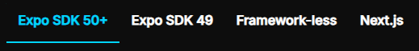
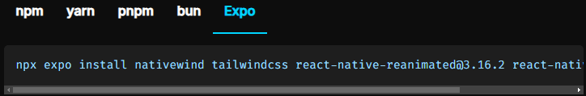

## 📦 Installation & Setup

Step by step how to install react native + native wind (expo framework)

**Guide**

## 1. Go to offical [React Native](https://reactnative.dev/docs/typescript) Page

_open terminal and create new project_

```sh
npx create-expo-app --template
```

now you have 4 option to choose template:<br/>
i. Blank,<br/>
ii. Blank(TypeScript),<br/>
iii. Navigation(TypeScript),<br/>
iv. Blake (Bare)<br/>
-> choose ii

after installation complete go to your project

```sh
cd ./(project_file)
```

## 2. Go to offical [NativeWind](https://www.nativewind.dev/getting-started/installation) Page

_check your dependencies(package.json), what expo version you are using (for me v52.0.35)_



select Expo 50+, Installation with Expo SDK 50+ select Expo



```sh
npx expo install nativewind tailwindcss react-native-reanimated@3.16.2 react-native-safe-area-context
```

For Setup Tailwind CSS

```sh
npx tailwindcss init
```

add this config to "tailwind.config.js"

```js
/** @type {import('tailwindcss').Config} */
module.exports = {
  //  * NOTE: Update this to include the paths to all of your component files.
  //  example ->
  //   content: [
  // "./App.{js,jsx,ts,tsx}", -> apply tailwind css in App.tsx
  // "./components/**/*.{js,jsx,ts,tsx}", -> apply tailwindcss whole components folder
  // "./screens/**/*.{js,jsx,ts,tsx}" -> apply tailwindcss whole screens folder
  // ]
  content: ['./App.{js,jsx,ts,tsx}'],
  presets: [require('nativewind/preset')],
  theme: {
    extend: {},
  },
  plugins: [],
};
```

after that create css file name "global.css"

```sh
touch global.css
```

add this code into "global.css"

```cs
@tailwind base;
@tailwind components;
@tailwind utilities;
```

after that update babel config file, if it does not exist then create one "babel.config.js"

```sh
touch babel.config.js
```

add this code into "babel.config.js"

```js
module.exports = function (api) {
  api.cache(true);
  return {
    presets: [
      ['babel-preset-expo', { jsxImportSource: 'nativewind' }],
      'nativewind/babel',
    ],
  };
};
```

after that update babel config file, if it does not exist then create one "metro.config.js"

```sh
touch metro.config.js
```

add this code into "metro.config.js"

```js
const { getDefaultConfig } = require('expo/metro-config');
const { withNativeWind } = require('nativewind/metro');

const config = getDefaultConfig(__dirname);

module.exports = withNativeWind(config, { input: './global.css' });
```
after that import your "global.css" file into main typescript file like "App.tsx"

```tsx
import "./global.css"

export default App() {
  /* Your App */
}
```

after that Modify your "app.json" for Switch the bundler to use the Metro bundler

```json
{
  "expo": {
    "web": {
      "bundler": "metro"
    }
  }
}
```

## 3. Optional [TypeScript](https://www.nativewind.dev/getting-started/typescript) Page

create a new file "nativewind-env.d.ts"

```sh
touch nativewind-env.d.ts
```

then add this code into "nativewind-env.d.ts"

```ts
/// <reference types="nativewind/types" />
```

## 4. Run Project
```sh
npm start
```
after that you will have all option (my case im using expo go app)

## 5. Install Expo go app/ios
* [Android PlayStore](https://play.google.com/store/apps/details?id=host.exp.exponent&hl=en)
* [IOS AppStore](https://apps.apple.com/us/app/expo-go/id982107779)

scan qr code and you good to go

if you want to install something with expo simply install with example:
```
npx expo install react-native-gesture-handler
```